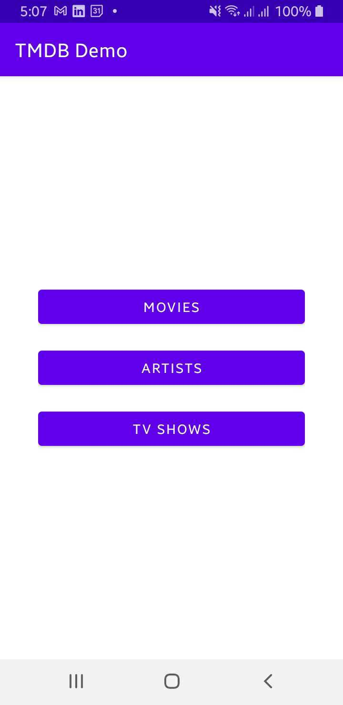

#The Movie Database (TMDB) Demo App

 

    

 

## Architecture
* Built with MVVM

## Built With 🛠
- [Kotlin](https://kotlinlang.org/) - Official programming language for Android development.
- [Room](https://developer.android.com/jetpack/androidx/releases/room) - The Room persistence library provides an abstraction layer over SQLite to allow for more robust database access while harnessing the full power of SQLite.
- [DataBinding](https://developer.android.com/topic/libraries/data-binding) - Support library that allows to bind UI components.
- [Dagger 2](https://developer.android.com/training/dependency-injection/dagger-basics) - Dagger frees you from writing tedious and error-prone boilerplate code.
- [Coroutines](https://developer.android.com/kotlin/coroutines) - A coroutine is a concurrency design pattern that you can use on Android to simplify code that executes asynchronously.
- [LiveData](https://developer.android.com/topic/libraries/architecture/livedata) - LiveData is an observable data holder class. Unlike a regular observable, LiveData is lifecycle-aware.
- [Retrofit](https://square.github.io/retrofit/) - A type-safe HTTP client for Android and Java.
- [TMDB API](https://www.themoviedb.org/) - The Movie Database is a free and open sourced movie and TV show database.
